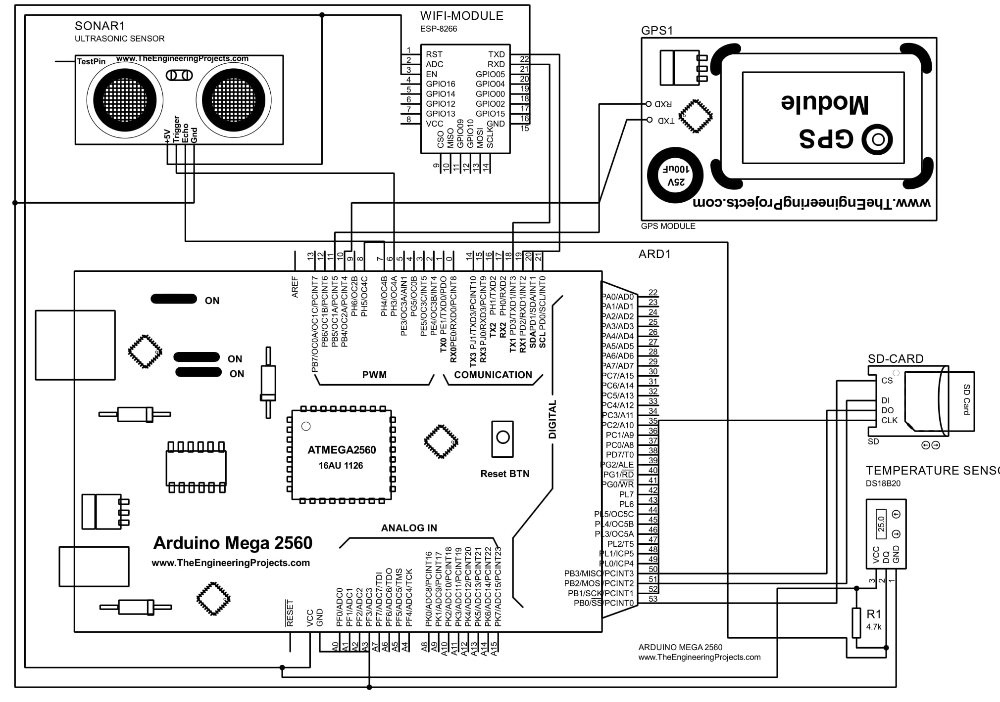
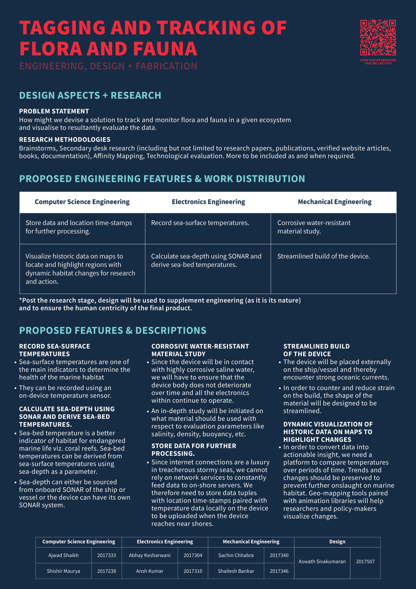

# OH-MISS

# Design Project

* Product Features
    1. Record sea-surface temperatures.
    2. Calculate sea-depth using SONAR and derive sea-bed temperatures.
    3. Store data and location timestamps for further processing.
    4. Visualize historic data on map to locate and highlight regions with dynamic habitat changes for research and action.
    5. Corrosive water-resistant material study
    6. Streamlined build of the device
# Feature Selection 
  
* Record sea-surface temperatures.

  * Sea-surface temperatures are one of the main indicators to determine the health of the marine habitat
  * They can be recorded using an on-device temperature sensor.

* Calculate sea-depth using SONAR and derive sea-bed temperatures.
    * Sea-bed temperature is a better indicator of habitat for endangered marine life viz. coral reefs. Sea-bed temperatures can be derived from sea-surface temperatures using sea-depth as a parameter.
    * Sea-depth can either be sourced from onboard SONAR of the ship/vessel or the device can have its own SONAR system.

* Store data and location timestamps for further processing.
    * Since internet connections are a luxury in treacherous stormy seas, we cannot rely on network services to constantly feed data to on-shore servers. 
    * We therefore need to store data tuples with location timestamps paired with temperature data locally on the device to be uploaded when the device reaches near shores.

* Visualize historic data on map to locate and highlight regions with dynamic habitat changes for research and action.
    * In order to convert data into actionable insight, we need a platform to compare temperatures over periods of time. We would get a general trend of temperature changes and those regions changing rapidly should be preserved to prevent further onslaught on marine habitat.
    * We will use geo-mapping tools paired with animation libraries over different periods of time to help researchers and policy-makers visualize changes.

* Corrosive water-resistant material study
    * Since the device will be in contact with highly corrosive saline water, we will have to ensure that the device body does not deteriorate over time and all the electronics within continue to operate without malfunction.
    * An in-depth study will be initiated on what material should be used with respect to evaluation parameters like salinity, corrosiveness, density, buoyancy, etc.

* Streamlined build of the device
    * The device will be placed externally on the ship/vessel and thereby encounter strong oceanic currents. 
    * In order to counter and reduce strain on the build, the shape of the material will be designed to be streamlined. 

# Circuit Image

.
    

# Poster 
.
    

* live data visualisation
  https://oh-miss.web.app/

